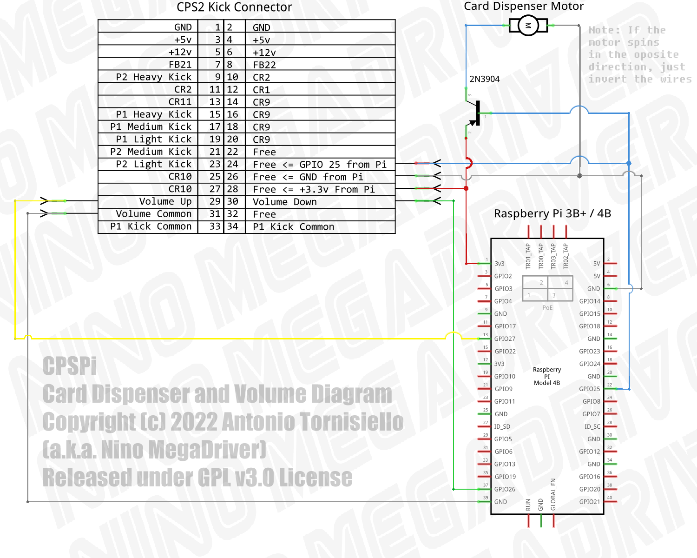

# CPSPi
## A Capcom Play System Raspberry PI based multi-game Jamma build - With Card Dispenser Support
  
**DISCLAIMER:** Neither this project nor any of its files, software, pictures, etc, are endorsed, approved or even consent by Capcom. All the Logos, IPs, Games, etc, are copyrighted by Capcom and was used under the terms of [Fair Use](https://www.copyright.gov/fair-use/)  
  
  
  
  
This project started with the objective of creating an alternative for other expensive (and yet not fully complete), multi-game solutions for the Capcom Play System 1, 2 and 3. At the end, and according to the parent's GPL license, I've decided to open all the sources and document the techniques I've used on this github page.  
  
This project uses the Rasperry 4B (the 3B+ should also be compatible) as the base system, taking advantage of its vga666 overlay to get the exact resolution and signal levels of the original boards, along with a Raspberry PI Pico micro-controller for interfacing all the inputs, plus the side buttons, such as volume and test menu, and other auxiliary hardware for the so (in)famous Brazilian Card Dispenser.  
  
## The Jamma Board  
  
  
As complicated as the above picture may look like, it's really not that much. It's the [PiPiCoJamma](https://github.com/ninomegadriver/PiPicoJamma) board assembled, hooked to a Raspberry PI 4 and a Raspberry PI Pico using flat cables and jumpers, instead of the traditional pin headers, to fit inside the original CPS2 housing.  
  
This Jamma Board hooks up the Pi 4B (or 3B+) via GIPIO, the VGA666 Overlay to get a RGB signal for the arcade monitor and a Raspberry Pi Pico micro-controller as a keyboard interface. Please check the [PiPiCoJamma Github's Page](https://github.com/ninomegadriver/PiPicoJamma) for complete information and instructions regarding this base Jamma board.  
  
In addiction to the onboard functions of the [PiPiCoJamma](https://github.com/ninomegadriver/PiPicoJamma), I've also hooked up the side buttons and the some extra hardware for the card dispenser.  
  
## The CPS2 Side Buttons    
  

As you may know, the CPS2 boards have three side buttons: Test, Volume Up and Volume Down. For that, I've installed a small breadboard with standard push buttons soldered and hot glued in place. All three buttons have a common pin wired to main ground.  
  
  
  
The "Test" button can be wired directly to the Jamma 15th Pin. If you look the above picture closely, you'll notice a green jumper wire soldered and fixed in place with hot glue right in the middle of the board.  
  
The "Volume Up" and "Volume Down" should be soldered to the Raspberry PI GPIOs 27 and 26. Just a straight jumper, no resistors needed.  
  
## The Card Dispenser  
  
In late 90s, following the lack of public interest on arcade games caused by the so new generation of home game consoles, some manufacturers had to use their creativity to regain the audience's attention.  
  
**"ROMSTAR"** the Brazilian, and if I'm not mistaken also Latin American, official Capcom representative, came up with this instantly loved prize mechanism.  
  
Taking advantage of unused ports on the extra kick connector, but that was also left mapped into the main game board hardware, they've created an auxiliary piece of hardware to give out collective cards. As an "official hack", some games were modified to give out collective cards whenever you beat it without using any sort of facilitators, such as playing against another player, continues, etc.
  
Sample Card Front | Sample Card Back  
:-------------------------:|:-------------------------:  
|  
  
[I've provided the whole collection of cards scanned here](Cards_Scan)  
  
The original mechanism had a +5v logical board, a +12v motor and a housing to keep it all in place, along with an iconic front plate with that beloved "Capcom" writing.  
  
Ok! So why not use the original hardware in this project?  
Well, because it's rare, it's way too expensive and almost all of them are mis functional due to heavy aging.  
  
Luckily with some cheap components and a 3D printer, creating a new one is not that challenging: 
  
Actual Card Dispenser | The STL Model  
:-------------------------:|:-------------------------:  
|  

## Printing The Card Dispenser
  
The model consists in six parts and should be printed in PLA as follows:  
  
STL | Instructions  
:-------------------------:|:-------------------------:  
| The Front Plate: Print it with 100% infill for better strength although any other settings should also work. This is just a decorative part.
| Cards Pile Stock: the walls are just 1mm, so a 100% infill print will be needed.  
| Cards Stock Front Door: Again, the wall is just 1mm thick. I'd strongly recommend printing it standing up as in the picture so you won't loose accuracy. Also print it with 100% infill.  
| The Motor Housing: This is the most important part of the build. The side strips have a triangular top so we don't need the addiction of any support. This enclosure must be strong, otherwise the whole thing will move off place when the motor starts running. So, print it with 100% infill.  
| The Motor Wheel: This is just a standard cube with a whole in the center. A 10% infill would be enough, although I'd recommend print it in the same position as in the picture, to not lose any accuracy on the circumference.  
| Weight Enclosure: This is a hollow part with a small circle hole in a corner. The meaning of this part is to add weight on top of the pile of cards. Print as in the picture, standing UP, with no support and 100% infill.

## Assembling the Card Dispenser
  
Along with the printed parts, you'll also need:  

A Standard "Arduino" DC Motor | Some Screws (3x50mm)
:-------------------------:|:-------------------------:  
|  
  
The parts are quite intuitive, so use your imagination.
  
For gluing the parts together I personally like to use a mix of super glue and charcoal or graphite powder. This mixture is really strong and won't deform your parts, such as using hot clue or another method using PLA itself. Usually, I apply some power over the surface followed by some drops of Super Glue. If you print the parts in black PLA it will also give a reasonable nice finish.  
  
  
  
Glue the "Cards Pile Stock" and the "Motor Enclosure" together so the opening for the motor wheel matches up.  
  
  
  
Using some long screws, mount the "Motor Wheel" into the "DC Motor" and fix it in the side strips of the "Motor Enclosure" part.  
  

  
For better adhesion on the cards, use a 25mm double sided tape on the motor wheel. However, don't leave glue on the outer face that will be touching the cards. After you apply the tape to the wheel, the easiest way to remove the glue from the outer side is just moving it over a piece of fabric.  
  
Put some cards in the compartment and ddjust the motor wheel hight so it touches the bottom card. Then, pull the bottom card partially out and fix the front cover as its bottom part barely touches the outgoing card.  
    
  
  
  
  
The adjustment of the whole system also depends on putting some weight on top of the cards pile so the bottom card will always get in place to be expelled.  
  
For that, use the "Weight Enclosure" printed part:  

  
This part was developed so it would house "3T fishing balls" inside. Buy some and insert some inside as much as needed:    
  
  
## Circuit Diagram  
  
The 3.3v power from the Raspberry PI should be enough to drive the DC motor with some torque and speed. The only extra component needed is a 2N3904 or any other general purpose NPN transistor.  

  

https://downloads.raspberrypi.org/raspios_lite_armhf/images/raspios_lite_armhf-2022-09-26/2022-09-22-raspios-bullseye-armhf-lite.img.xz
